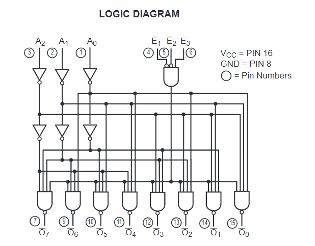

# 74138
These circuits  are  designed  to  be  used in   high-performance   memory-decoding   or   data-routing applications,  requiring  very  short  propagation  delay  times. In high-performance memory systems these decoders can be used to minimize the effects of system decoding. When used  with  high-speed  memories,  the  delay  times  of  these decoders  are  usually  less  than  the  typical  access  time  of the  memory.  This  means  that  the  effective  system  delay introduced by the decoder is negligible.
The  DM74LS138  decodes  one-of-eight  lines,  based  upon the  conditions  at  the  three  binary  select  inputs  and  the three  enable  inputs.  Two  active-low  and  one  active-high enable inputs reduce the need for external gates or inverters  when  expanding. An enable input can be used as a data input for demultiplexing applications.

The logic diagram is showed below:

## Challenges
1. Implement with logic operators
1. Implement with process using IF
1. Implement with process using CASE
1. Implement with WHEN…ELSE
1. Implement with WITH…SELECT
1. Design testbench and simulate
